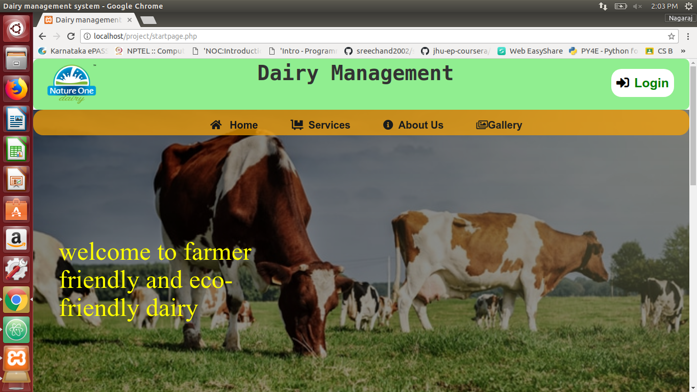
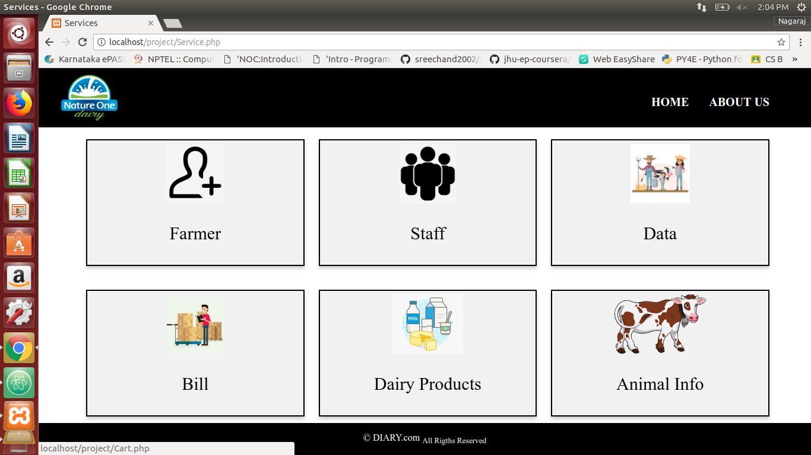
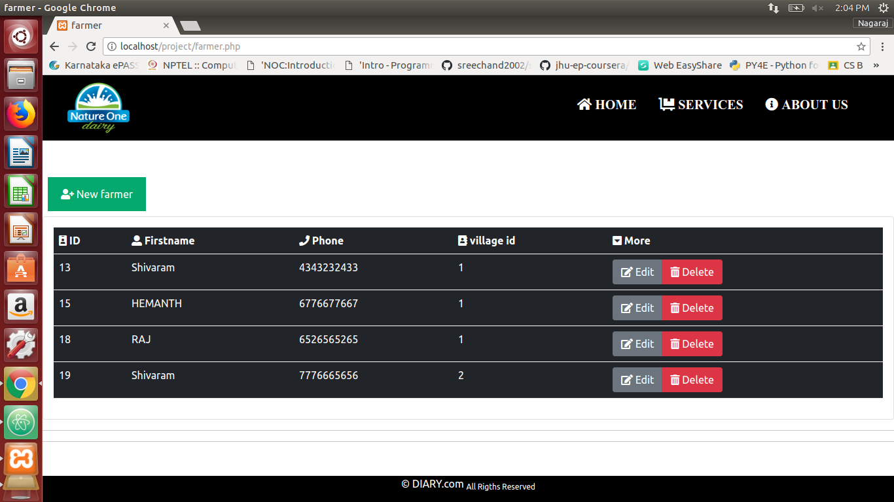
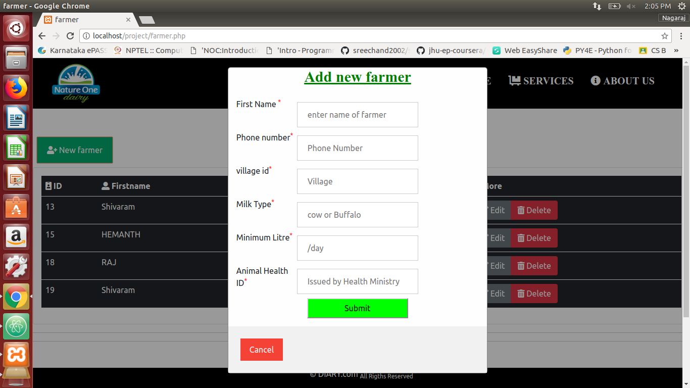

# Dairy-Manangement-System
This is a DBMS Miniproject named Dairy_Management_System.
## Languages Used

**FrontEnd:** Html, CSS, Bootstrap.

**Backend:**  php ,Mysql

## Description
This project contains different Modules like, 
->Login module. 
-> Farmer Details Module. 
-> Staff Details Module. 
-> Dairy Animal Details . 
->Daily Data entry Module. 
->Bill Module . 
->Dairy Products Module .

It Contains a Home page which has quick links to Home, Services,Gallery,About Dairy.

### startpage.php is the homepage . ###

### The Services has different links to the above mentioned modules which can be accessed from the services page. ###

### Farmer module Page is where the data of the new farmer and old farmer can be managed like can be added or deleted. ###

### Farmer module Page is where the data of the new farmer and old farmer can be managed like can be added or deleted. ###

### staff module Page is where the data of the staff can be managed. ###

### Animal inforamtion module is where the information regarding the animal i.e. Cow or Buffalo , min_litres of milk/day,Animal health ID can be accessed easily.### 

### Daily Data entry is where the registerd farmers sell their milk to the dairy on daily basis. ###

### Dairy Products is the products like Milk,Ghee,Butter e.t.c sold to the customers of the dairy. ###

### Bill is where the farmers can collect their bill from date to the to date.###

## Authors

- [@Nagaraj K](https://github.com/NAGARAJ08)

